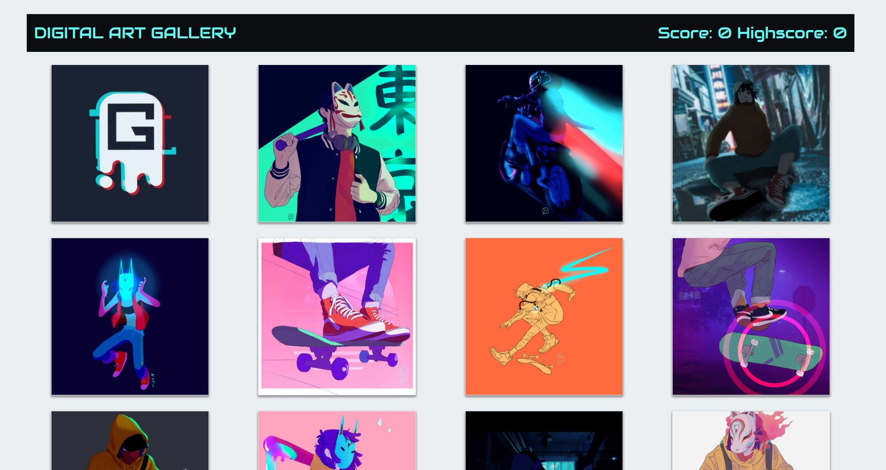
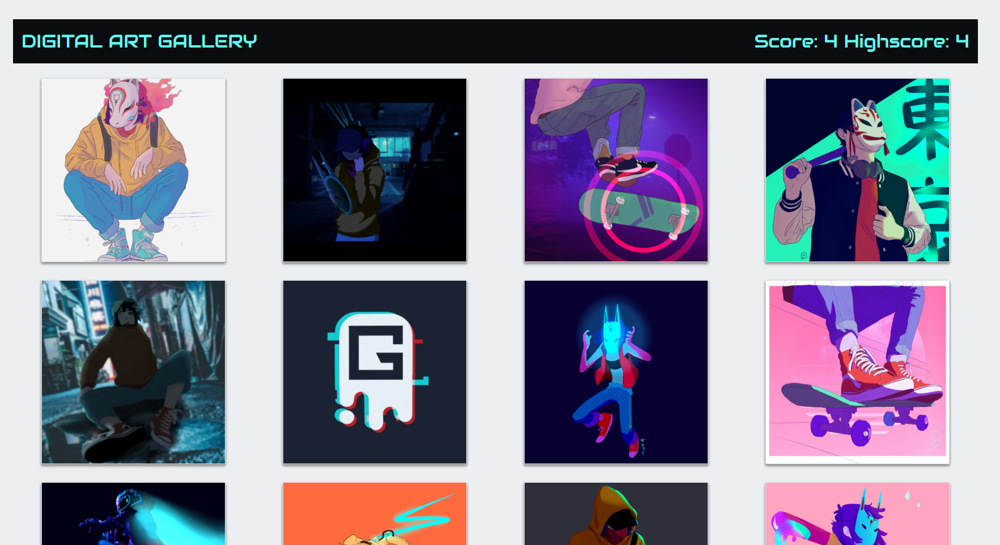
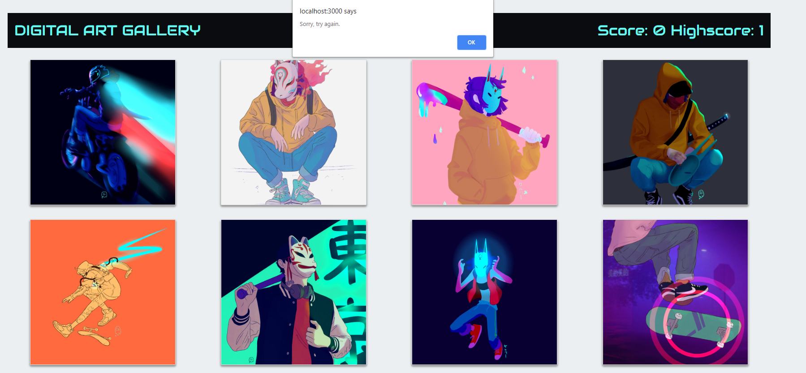
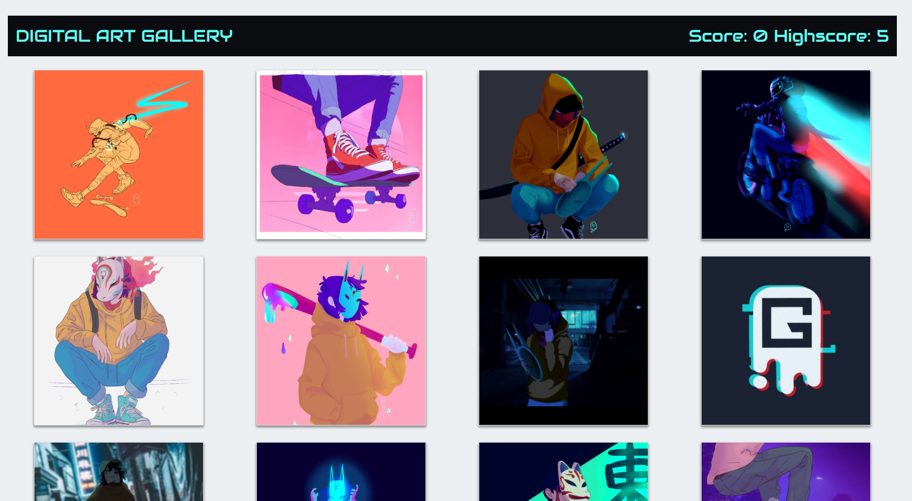

# React-Game

The React Clicky Game assignment is a memeory game that keeps score of your choices and shuffles the selection using react and my own digital art. 

As the player goes it keeps track of their score as well as raising their highscore and shuffling the cards every selection.

If the user clicks on the same image twice then they'll be alerted that they have lost the game 

and then the game will reshuffle the cards and the score will set to zero while their highscore is still displayed 

- - -

## Link to Active Game

https://afternoon-tundra-25018.herokuapp.com/

